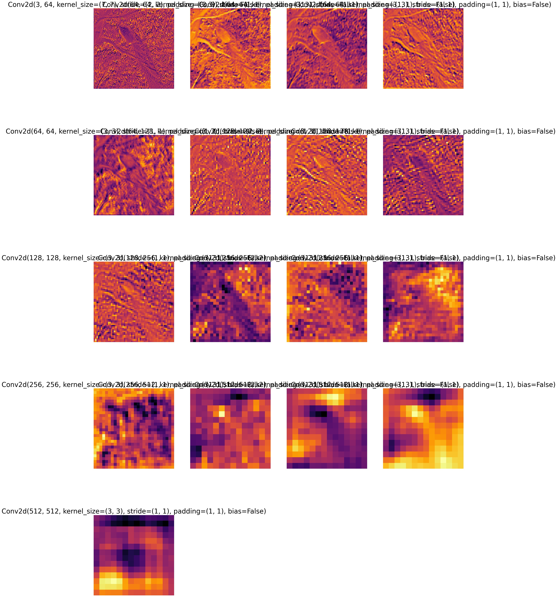

# ComputerVisionFinal
Final Project for Deep Learning Application II: Computer Vision

The repository contains the code to train a Conformer in a supervised manner and pre-train Conformer using SimCLR and fine-tune it on any dataset. The code also includes scripts to visualize the feature maps for conformer and perform a T-SNE analysis. Finally, I also include the code to train a Conformer using DINO.

[Link to Conformer Paper](https://arxiv.org/abs/2105.03889) and [repository](https://github.com/pengzhiliang/Conformer)

[Link to SimCLR Paper](https://arxiv.org/abs/2002.05709) and [repository](https://github.com/Spijkervet/SimCLR)

[Link to DINO Paper](https://arxiv.org/abs/2104.14294) and [repository](https://github.com/facebookresearch/dino)


For SimCLR pretraining in the SimCLR directory execute 

```
python main.py --dataset CIFAR10
```

the model will be saved in the directory specified at config/config.yaml

To FineTune Conformer using a SimCLR pretrained model, specify the model path at the run.sh file and then run

```
sh run.sh
```

To visualize the feature map and attention layer output use:

```
python feature_maps.py -model_path model_path
```

